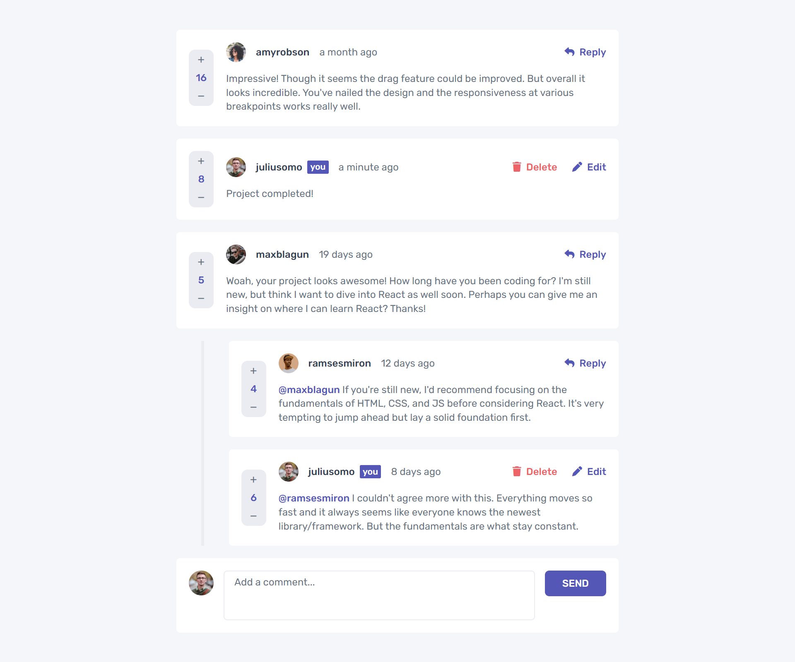

# Frontend Mentor - Interactive comments section solution

This is a solution to the [Interactive comments section challenge on Frontend Mentor](https://www.frontendmentor.io/challenges/interactive-comments-section-iG1RugEG9). Frontend Mentor challenges help you improve your coding skills by building realistic projects.

## Table of contents

-   [Overview](#overview)
    -   [The challenge](#the-challenge)
    -   [Screenshot](#screenshot)
    -   [Links](#links)
-   [My process](#my-process)
    -   [Built with](#built-with)
    -   [What I learned](#what-i-learned)
    -   [Useful resources](#useful-resources)
-   [Author](#author)

## Overview

### The challenge

Users should be able to:

-   View the optimal layout for the app depending on their device's screen size
-   See hover states for all interactive elements on the page
-   Create, Read, Update, and Delete comments and replies
-   Upvote and downvote comments
-   **Bonus**: If you're building a purely front-end project, use `localStorage` to save the current state in the browser that persists when the browser is refreshed.
-   **Bonus**: Instead of using the `createdAt` strings from the `data.json` file, try using timestamps and dynamically track the time since the comment or reply was posted.

### Screenshot



### Links

-   Solution URL: [Add solution URL here](https://your-solution-url.com)
-   Live Site URL: [Add live site URL here](https://your-live-site-url.com)

## My process

### Built with

-   [React](https://reactjs.org/) - JS library
-   [SCSS](https://sass-lang.com/) - For styles
-   [Font Awesome](https://fontawesome.com/) - For icons
-   [Google Fonts](https://fonts.google.com/) - For fonts

### What I learned

Use this section to recap over some of your major learnings while working through this project. Writing these out and providing code samples of areas you want to highlight is a great way to reinforce your own knowledge.

To see how you can add code snippets, see below:

To find _which comment to add the new reply to_, I looped over all of the comments and their replies. Here the comment's **index** in the `comments` array is returned so that the reply can be added to the item in the `comments` array with that index.

```js
const findComment = (commentId, isReply) => {
	let found = false;
	let commentIndex;
	let topLevelReplyIsFrom;
	comments.forEach((comment, commentIndexInComments) => {
		if (!found && comment.id === commentId && !isReply) {
			found = true;
			commentIndex = commentIndexInComments;
		} else {
			comment.replies.forEach((reply, replyIndex) => {
				if (!found && reply.id === commentId) {
					found = true;
					commentIndex = replyIndex;
					isReply = true;
					topLevelReplyIsFrom = commentIndex;
				}
			});
		}
	});
	return [commentIndex, topLevelReplyIsFrom];
};
```

To get the _relative time of a comment_, I used [MomentJS](https://momentjs.com/). It allowed me to add and format the **date and time of creation** to a comment and get the relative time to display next to the `username` inside the comment.

```js
const moment = require("moment");

const newComment = {
	createdAt: moment().format("DD-MM-YYYY, HH:mm:ss"),
};

export const getTimeAgo = timeCommentCreated => {
	return moment(timeCommentCreated, "DD-MM-YYYY, HH:mm:ss")
		.startOf("minute")
		.fromNow();
};
```

To _sort an array of objects_ by a property in the objects:

```js
comments.sort((a, b) => b.score - a.score);
```

To add a _shaded background_ when a `position: fixed` pop-up screen is shown:

```css
form.delete {
	position: fixed;
	width: 100vw;
	top: 0;
	bottom: 0;
	right: 0;
	left: 0;
	z-index: 1;
	background-color: black;
	opacity: 0.5;
}
```

### Useful resources

-   [MomentJS](https://momentjs.com/) - This can be used to get and format the current date and time, but it was especially helpful with formatting the relative time.

## Author

<!-- -   Website - [Add your name here](https://www.your-site.com) -->

-   Frontend Mentor - [@tices0](https://www.frontendmentor.io/profile/tices0)
-   Github - [@tices0](https://github.com/tices0)
