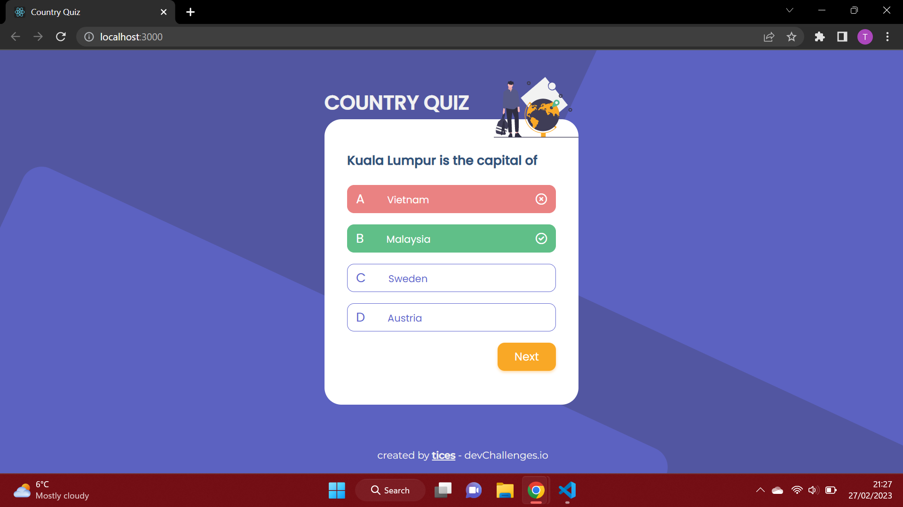

<!-- Please update value in the {}  -->

<h1 align="center">Country Quiz</h1>

<div align="center">
   Solution for a challenge from  <a href="http://devchallenges.io" target="_blank">Devchallenges.io</a>.
</div>

<div align="center">
  <h3>
    <a href="https://{your-demo-link.your-domain}">
      Demo
    </a>
    <span> | </span>
    <a href="https://{your-url-to-the-solution}">
      Solution
    </a>
    <span> | </span>
    <a href="https://devchallenges.io/challenges/Bu3G2irnaXmfwQ8sZkw8">
      Challenge
    </a>
  </h3>
</div>

<!-- TABLE OF CONTENTS -->

## Table of Contents

-   [Overview](#overview)
    - [What I learned](#what-i-learned)
    -   [Built With](#built-with)
-   [Features](#features)
-   [How to use](#how-to-use)
-   [Contact](#contact)
-   [Acknowledgements](#acknowledgements)

<!-- OVERVIEW -->

## Overview



<!-- Introduce your projects by taking a screenshot or a gif. Try to tell visitors a story about your project by answering:

-   Where can I see your demo?
-   What was your experience?
-   What have you learned/improved?
-   Your wisdom? :) -->

### What I learned

-   How to use one `ref` for multiple elements by using an **object**

```
const incorrectRef = useRef({});
<button ref={ref => (incorrectRef.current[question.options[key]] = ref)}></button>
```

### Built With

<!-- This section should list any major frameworks that you built your project using. Here are a few examples.-->

-   [React](https://reactjs.org/)
-   [Bootstap](https://getbootstrap.com/)
-   [SCSS](https://sass-lang.com/)

## Features

<!-- List the features of your application or follow the template. Don't share the figma file here :) -->

This application/site was created as a submission to a [DevChallenges](https://devchallenges.io/challenges) challenge. The [challenge](https://devchallenges.io/challenges/Bu3G2irnaXmfwQ8sZkw8) was to build an application to complete the given user stories.

## How To Use

<!-- Example: -->

To clone and run this application, you'll need [Git](https://git-scm.com) and [Node.js](https://nodejs.org/en/download/) (which comes with [npm](http://npmjs.com)) installed on your computer. From your command line:

```bash
# Clone this repository
$ git clone https://github.com/your-user-name/your-project-name

# Install dependencies
$ npm install

# Run the app
$ npm start
```

To start the quiz, simply choose one of the four options. The option clicked will turn either **green** or **red** to indicate whether you were correct or not. If you picked the wrong answer, you will have another chance to select the correct answer.

You can move on to the next question using the `Next` button.

-   If the correct answer is selected, you may move on to the next question.
-   After two attempts, you must move on to the next question.

At the end of the quiz, you will be shown your _score_. Click the `Try again` button to start the quiz over from the start.

## Acknowledgements

<!-- This section should list any articles or add-ons/plugins that helps you to complete the project. This is optional but it will help you in the future. For example: -->

-   [Font Awesome](https://fontawesome.com/)
-   [Firebase Hosting](https://firebase.google.com/)

## Contact

<!-- -   Website [your-website.com](https://{your-web-site-link}) -->

-   GitHub [@tices0](https://{github.com/tices0})
