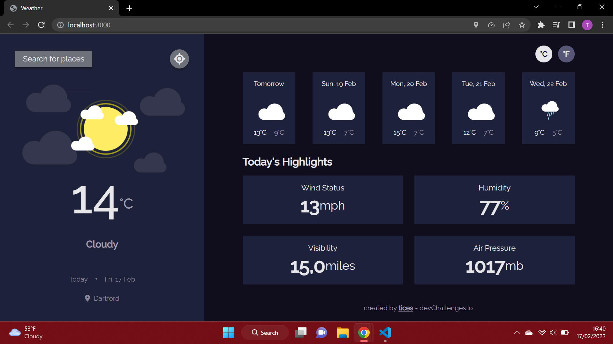

<!-- Please update value in the {}  -->

<h1 align="center">Weather App</h1>

<div align="center">
   Solution for a challenge from  <a href="http://devchallenges.io" target="_blank">Devchallenges.io</a>.
</div>

<div align="center">
  <h3>
    <!-- <a href="https://{your-demo-link.your-domain}">
      Demo
    </a>
    <span> | </span>
    <a href="https://{your-url-to-the-solution}">
      Solution
    </a> -->
    <!-- <span> | </span> -->
    <a href="https://devchallenges.io/challenges/mM1UIenRhK808W8qmLWv">
      Challenge
    </a>
  </h3>
</div>

<!-- TABLE OF CONTENTS -->

## Table of Contents

-   [Overview](#overview)
    -   [Built With](#built-with)
-   [Features](#features)
    - [Current Location](#Getting-the-current-location-of-the-user)
    - [Sharing Components](#Sharing-Components/Functions-between-Files)
    - [Using async/await](#Using-async/await-instead-of-.then)
-   [How to use](#how-to-use)
-   [Contact](#contact)
-   [Acknowledgements](#acknowledgements)

<!-- OVERVIEW -->

## Overview



Introduce your projects by taking a screenshot or a gif. Try to tell visitors a story about your project by answering:

-   Where can I see your demo?
-   What was your experience?
-   What have you learned/improved?
-   Your wisdom? :)

[mindmap](https://mm.tt/map/2575601274?t=Nr2gU4FpWC)

### Built With

<!-- This section should list any major frameworks that you built your project using. Here are a few examples.-->

-   [React](https://reactjs.org/)
-   [SCSS](https://sass-lang.com/)

## Features

<!-- List the features of your application or follow the template. Don't share the figma file here :) -->

This application/site was created as a submission to a [DevChallenges](https://devchallenges.io/challenges) challenge. The [challenge](https://devchallenges.io/challenges/mM1UIenRhK808W8qmLWv) was to build an application to complete the given user stories.

### Getting the Current Location of the User

This is done be using the `navigator`. An alert is shown to the user requesting for permission to get their location. 
```
if (navigator.geolocation) {
			navigator.geolocation.getCurrentPosition(position => {
				const lon = position.coords.longitude;
				const lat = position.coords.latitude;
			});
		} 
```

### Sharing Components/Functions between Files

The component/function needs to exported from the file it is declared in after it is declared. 
```
export const getData = async (lon, lat, celcius) => {
  ...
};
```

It can then be used in other files by being imported.  
```
import Sidebar from "./Sidebar";
import Main from "./Main";
```

### Using async/await instead of .then

```
async function getCountryCode(lon, lat) {
	const res = await fetch(
		`https://nominatim.openstreetmap.org/reverse?format=geojson&lat=${lat}&lon=${lon}`,
	);
	const data = await res.json();
	return data.features[0].properties.address.country_code;
}
```

## How To Use

<!-- Example: -->

To clone and run this application, you'll need [Git](https://git-scm.com) and [Node.js](https://nodejs.org/en/download/) (which comes with [npm](http://npmjs.com)) installed on your computer. From your command line:

```bash
# Clone this repository
$ git clone https://github.com/tices0/React-Projects

# Install dependencies
$ npm install

# Run the app
$ npm start
```

## Acknowledgements

<!-- This section should list any articles or add-ons/plugins that helps you to complete the project. This is optional but it will help you in the future. For example: -->

-   [font awesome](https://fontawesome.com/)
-   [countries and timezones](https://github.com/manuelmhtr/countries-and-timezones)

## Contact

<!-- -   Website [your-website.com](https://{your-web-site-link}) -->

-   GitHub [@tices](https://{github.com/tices})
